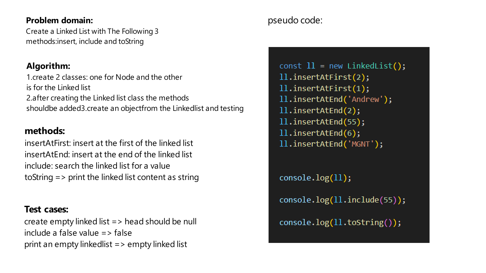

# Challenge Title
Create a Linked kist with the following methods: insert, include and toSTring

## Whiteboard Process


## Approach & Efficiency
first define the node structure, then you can create the linked list class and the methods. The big O for the linked list is O(n)

## Solution
firat we should initiate the linked list:
```js
const ll = new LinkedList();
```

then uses the methods to create nodes and get them etc..
```js
ll.insertAtEnd(1);
ll.insertAtEnd(2);
console.log(ll.include(2));
console.log(ll.toString());
```

The methods are:
```js
insertAtEnd()
include()
toString()
insertAtFirst()
```
