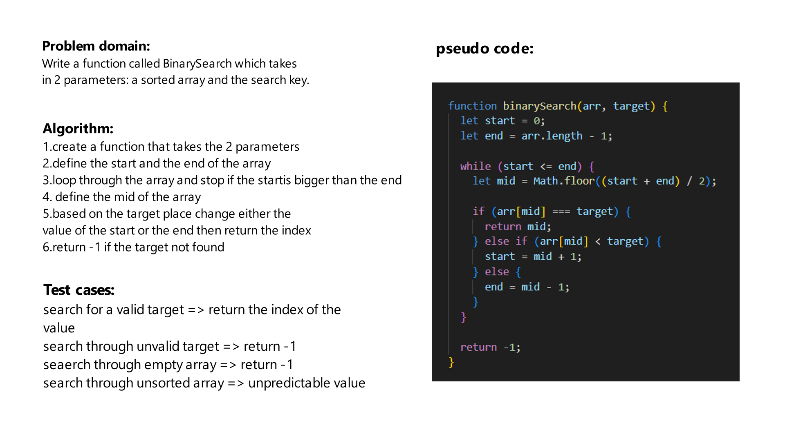

# Challenge Title
Write a function called BinarySearch which takes in 2 parameters: a sorted array and the search key. Without utilizing any of the built-in methods available to your language, return the index of the array’s element that is equal to the value of the search key, or -1 if the element is not in the array.

## Whiteboard Process

## Approach & Efficiency
The Big O for the binary Search is O(log n)

## Solution
In order to run the the code you should call the function, and pass an **order** array ex:[1,2,3] and a valid target to search for its index ex:1, so the output will come as 0

## unit test
