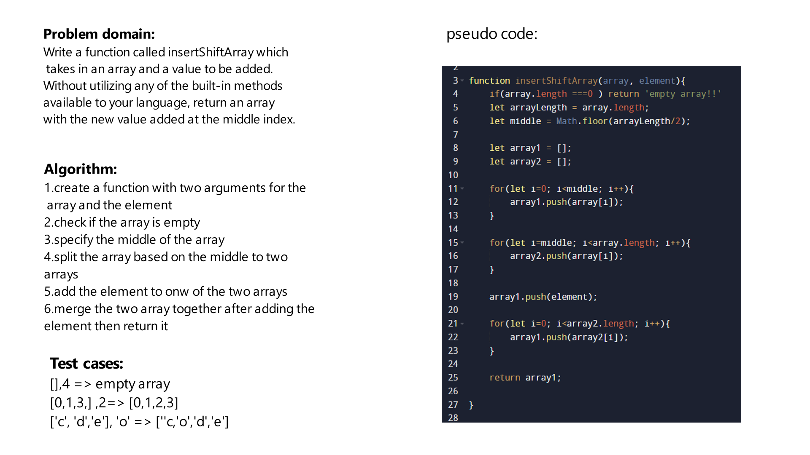

# Challenge Title
Write a function called insertShiftArray which takes in an array and a value to be added. Without utilizing any of the built-in methods available to your language, return an array with the new value added at the middle index.

## Whiteboard Process

## Approach & Efficiency
The time complexity of inserting an element in the middle of an array is O(n/2) or O(n) 

## Solution
In order to run the the code you should call the insertShiftArray function, if we got an array called array1 [0,1,3,4] and we send it aloong with the element 2 as an arguments to the function, the element should be added as follow [0,1,2,3,4]