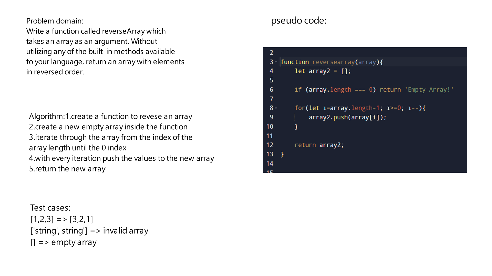

# Challenge Title
Write a function called reverseArray which takes an array as an argument. Without utilizing any of the built-in methods available to your language, return an array with elements in reversed order.

## Whiteboard Process

## Approach & Efficiency
The Big O space/time for a JavaScript reverse array method is O(1) space complexity and O(n) time complexity

## Solution
In order to run the the code you should call the function, if we got an array called array1 [1,2,3] and we send it as an argument to the reverse functions, it will be reversed as follow [3,2,1]