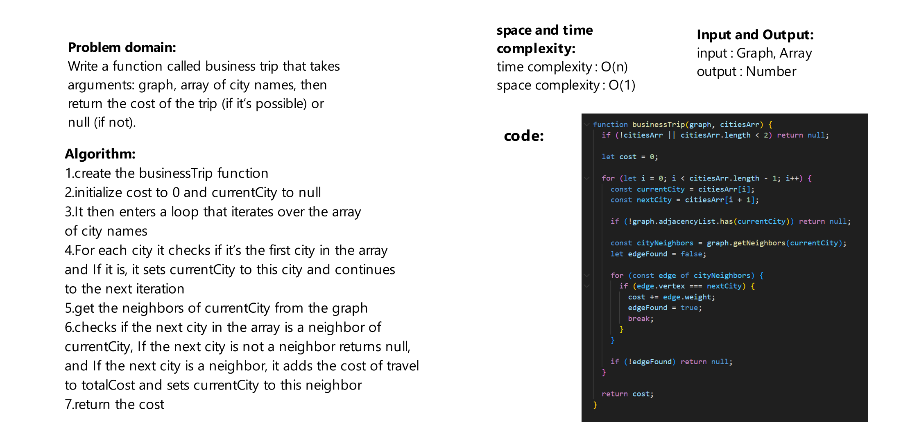

# Challenge Title
Write a function called business trip that takes arguments: graph, array of city names, then return the cost of the trip (if it’s possible) or null (if not).

## Whiteboard Process


## Approach & Efficiency
time complexity :  O(n), where n is the number of cities in the array.

space complexity : O(1)

## Solution
```js
let cititesGraph = new Graph();

let roma = new Vertext('roma');
let venice = new Vertext('venice');
let florence = new Vertext('florence');

cititesGraph.addVertex(roma);
cititesGraph.addVertex(venice);
cititesGraph.addVertex(florence);

cititesGraph.addEdge(roma, venice, 5);
cititesGraph.addEdge(venice, florence, 10);

let cities = [roma, venice, florence];

console.log(businessTrip(cititesGraph, cities));

```
