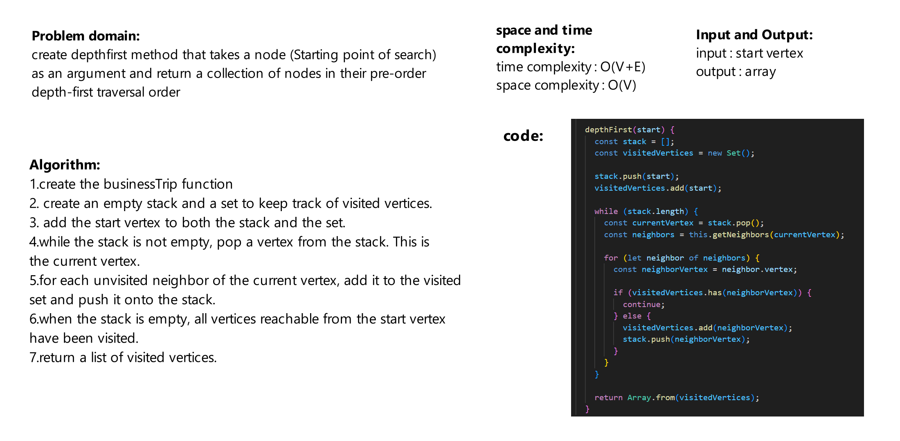

# Challenge Title
create depthfirst method that takes a node (Starting point of search) as an argument and return a collection of nodes in their pre-order depth-first traversal order

## Whiteboard Process


## Approach & Efficiency
-time complexity :   

O(V + E), where V is the number of vertices and E is the number of edges in the graph.

-space complexity : 

O(V)

## Solution
```js
const graph = new Graph();

const one = new Vertext(1);
const two = new Vertext(2);
const three = new Vertext(3);
const four = new Vertext(4);
const five = new Vertext(5);
const six = new Vertext(6);

graph.addVertex(one);
graph.addVertex(two);
graph.addVertex(three);
graph.addVertex(four);
graph.addVertex(five);
graph.addVertex(six);


graph.addEdge(one, two);
graph.addEdge(one, three, 5);
graph.addEdge(two, four);
graph.addEdge(two, five);
graph.addEdge(four, three);
graph.addEdge(five, six);

console.log(graph.depthFirst(one));
```
