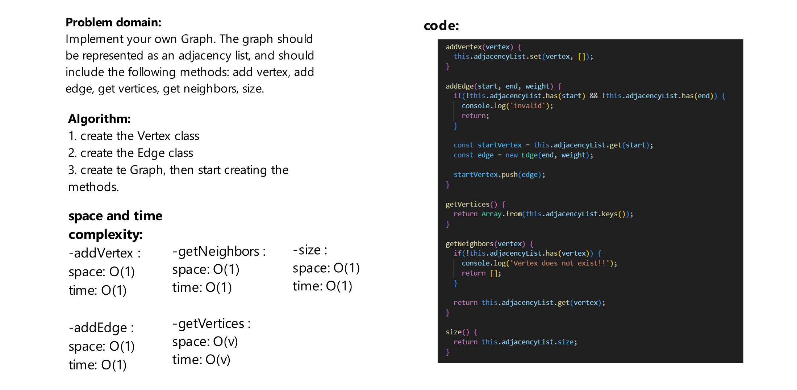

# Challenge Title
Implement your own Graph. The graph should be represented as an adjacency list, and should include the following methods:
add vertex, add edge, get vertices, get neighbors, size.

## Whiteboard Process


## Approach & Efficiency
time complexity :  O(V), where V is the number of vertices.

space complexity : O(V+E), where E is the number of edges in the graph.

## Solution
firat we should initiate the 2 linked lists:
```js
const graph = new Graph();

const one = new Vertext(1);
const two = new Vertext(2);
const three = new Vertext(3);
const four = new Vertext(4);
const five = new Vertext(5);
const six = new Vertext(6);

graph.addVertex(one);
graph.addVertex(two);
graph.addVertex(three);
graph.addVertex(four);
graph.addVertex(five);
graph.addVertex(six);


graph.addEdge(one, two);
graph.addEdge(one, three, 5);
graph.addEdge(two, four);
graph.addEdge(two, five);
graph.addEdge(four, three);
graph.addEdge(five, six);
```
