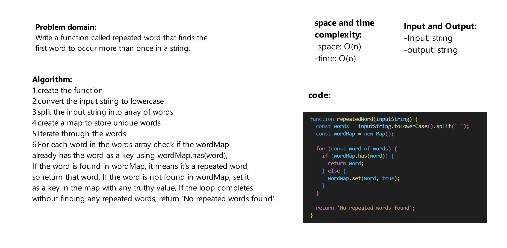

# Challenge Title
Write a function called repeated word that finds the first word to occur more than once in a string

## Whiteboard Process


## Approach & Efficiency
time complexity :  O(n)

space complexity :  O(n)

## Solution
firat we should initiate the 2 linked lists:
```js
let string = 'this is not jackblack, this is Tom';
let result = repeatedWord(string);
console.log(result);
```
