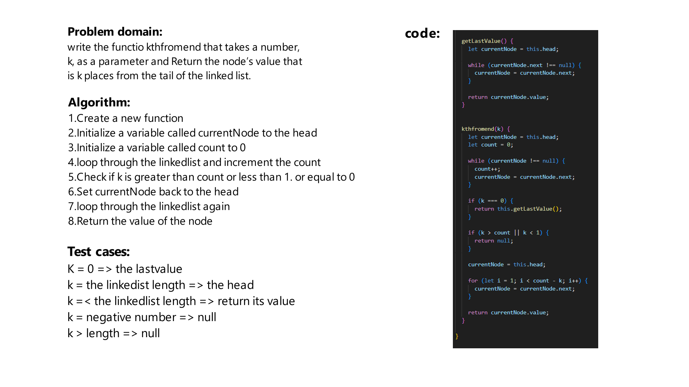

# Challenge Title
write the functio kthfromend that takes a number, k, as a parameter and Return the node’s value that is k places from the tail of the linked list.

## Whiteboard Process


## Approach & Efficiency
first define the node structure, then you can create the linked list class and the methods.

The big O for the linked list is O(n)

## Solution
firat we should initiate the linked list:
```js
const ll = new LinkedList();
```

then uses the methods to create nodes and get them etc..
```js
ll.append(1);
ll.append(2);
ll.append(3);
ll.kthfromend(2)//1
```

The methods are:
```js
append()
include()
toString()
insertBeforeValue()
insertAfterValue()
kthfromend()
```
