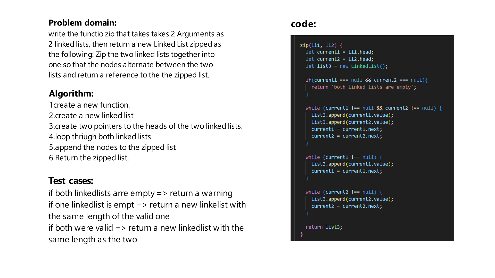

# Challenge Title
write the functio zip that takes takes 2 Arguments as 2 linked lists, then return a new Linked List zipped as the following:
Zip the two linked lists together into one so that the nodes alternate between the two lists and return a reference to the the zipped list.

## Whiteboard Process


## Approach & Efficiency
first define the node structure, then you can create the linked list class and the methods.

The big O for the linked list is O(n)

## Solution
firat we should initiate the 2 linked lists:
```js
const ll1 = new LinkedList();
const ll2 = new LinkedList();
```

then use the method to zip the 2 linked lists
```js
const ll1 = new LinkedList();
ll1.append(1);
ll1.append(2);
ll1.append(3);
const ll2 = new LinkedList();
ll1.append(4);
ll1.append(5);
ll1.append(6);
let zippedList = ll1.zip(ll1, ll2);
```

The methods are:
```js
append()
include()
toString()
insertBeforeValue()
insertAfterValue()
kthfromend()
zip()
```
