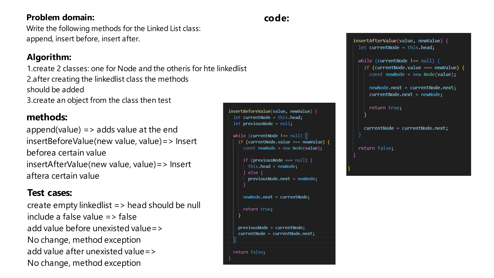

# Challenge Title
Write the following methods for the Linked List class: append, insert before, insert after.

## Whiteboard Process


## Approach & Efficiency
first define the node structure, then you can create the linked list class and the methods. 

The big O for the linked list is O(n)

## Solution
firat we should initiate the linked list:
```js
const ll = new LinkedList();
```

then uses the methods to create nodes and get them etc..
```js
ll.append('Andrew');
ll.append(2);
ll.insertBeforeValue('Ben','Andrew');
ll.insertAfterValue(555,2);
```

The methods are:
```js
append()
insertBeforeValue()
insertAfterValue()
```
