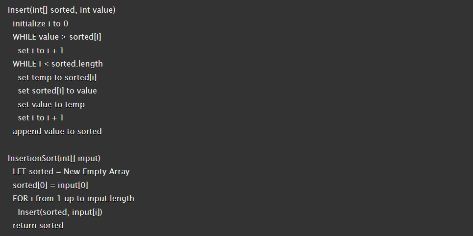
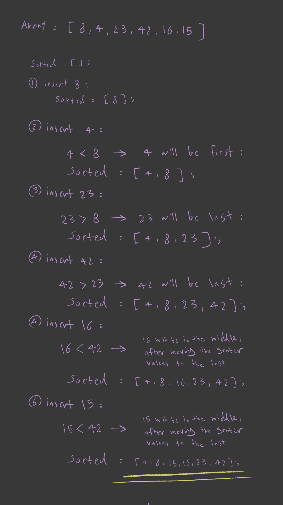

# Insertion Sort

nsertion Sort is a simple sorting algorithm that builds the final sorted array one element at a time. It is much less efficient on large lists than more advanced algorithms such as quicksort, heapsort, or merge sort. However, it is easy to understand and implement, making it useful for educational purposes and for small datasets.

## Pseudocode

## Trace

