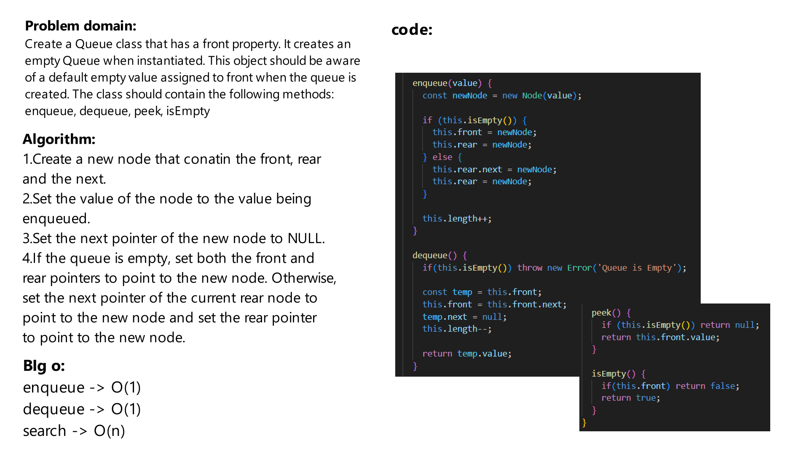

# Challenge Title
Using a Linked List as the underlying data storage mechanism, implement both a Stack and a Queue

## Whiteboard Process
Salck:


Queue:



## Approach & Efficiency
first define the node structure, then you can create both the stack and the queue classes using linkedlist data structure.

The big O notation for the stack data structure is O(1) for insertion and deletion. For searching an element the big O is O(n).

The big O notation for the queue data structure is O(1) for insertion and deletion. For searching an element, the big O  is O(n).

## Solution
firat we should initiate the Stack and the Queue:
```js
const stack = new Stack();

const queue = new Queue();
```

then use their methods
```js
//stack
queue.push(1);
queue.push(2);
queue.pop();//2
queue.isEmpty();//false
queue.peek();//1

//queue
queue.enqueue(1);
queue.enqueue(2);
queue.dequeue();//2
queue.isEmpty();//false
queue.peek();//1
```

The methods are:

-for stack:
```js
push(value);
pop();
isEmpty();
peek();
```

-for queue:
```js
enqueue(value);
dequeue();
isEmpty();
peek();
```
