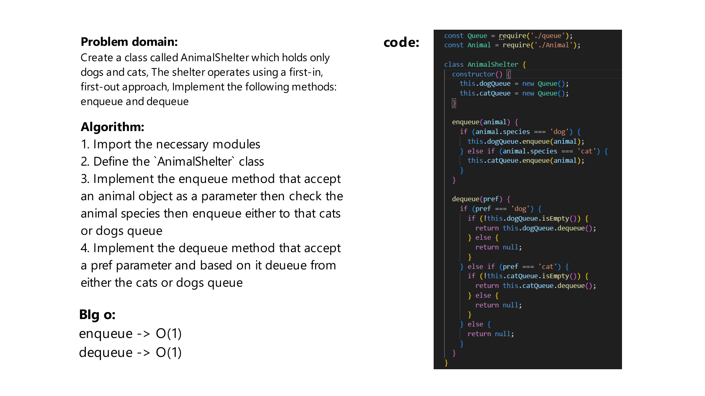

# Challenge Title
Create a class called AnimalShelter which holds only dogs and cats, The shelter operates using a first-in, first-out approach, Implement the following methods: enqueue and dequeue

## Whiteboard Process



## Approach & Efficiency
enqueue -> O(1)
dequeue -> O(1)

## Solution
firat we should initiate the following:
```js
  let shelter = new AnimalShelter();

  const cat1 = new Animal('cat', 'sparkles');
  const dog1 = new Animal('dog', 'jack');
```

then use their methods
```js
shelter.enqueue(cat1);
shelter.enqueue(dog1);
shelter.dequeue(cat1);
```

The methods are:
```js
enqueue(value);
dequeue('cat');
```
