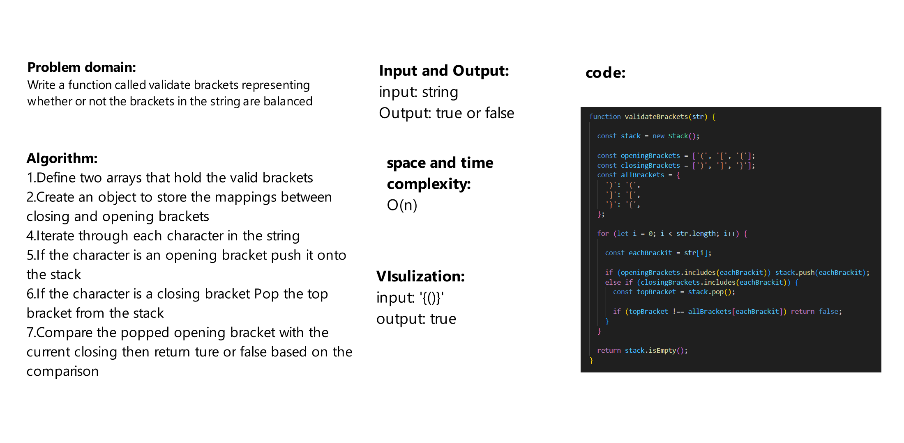

# Challenge Title
Write a function called validate brackets that representing whether or not the brackets in the string are balanced has the arguments as string and return boolean

## Whiteboard Process



## Approach & Efficiency
The big O notation for this function is O(n)

## Solution

```js
validateBrackets(str);
```
