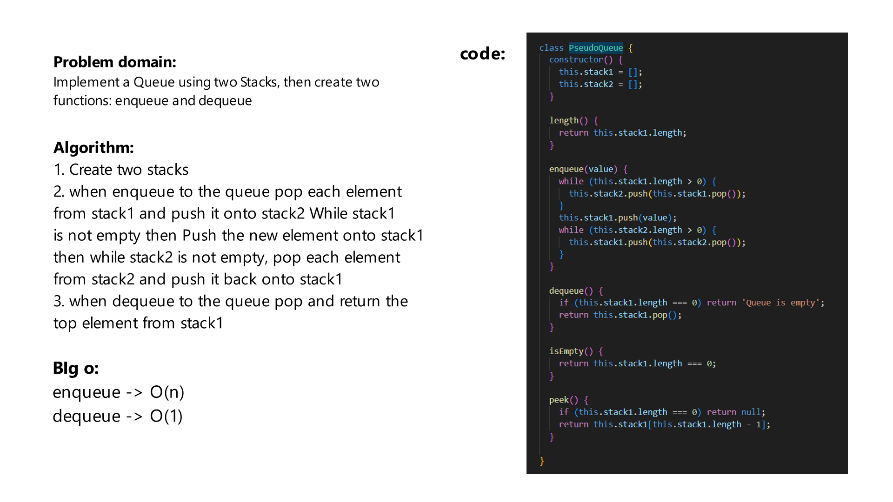

# Challenge Title
Implement a Queue using two Stacks, then create two functions: enqueue and dequeue

## Whiteboard Process



## Approach & Efficiency
enqueue -> O(n)
dequeue -> O(1)

## Solution
firat we should initiate the the Queue:
```js
const queue = new PseudoQueue();
```

then use their methods
```js
queue.enqueue(1);
queue.enqueue(2);
queue.enqueue(3);
queue.dequeue();//1
```

The methods are:
```js
enqueue(value);
dequeue();
length();
isEmpty();
peek();
```
