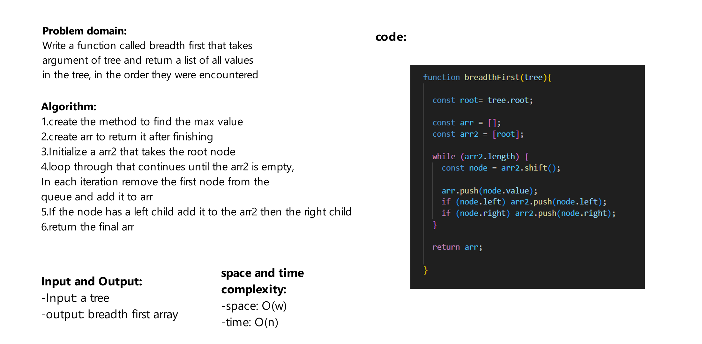

# Challenge Title
Write a function called breadth first that takes argument of tree and return a list of all values in the tree, in the order they were encountered

## Whiteboard Process



## Approach & Efficiency

space: O(w)

time: O(n)


## Solution
```js
const two = new Node(2);
const seven = new Node(7);
const five = new Node(5);
const two2 = new Node(2);
const six = new Node(6);
const nine = new Node(9);
const five2 = new Node(5);
const eleven = new Node(11);
const four = new Node(4);

two.left = seven;
two.right = five;

seven.left = two2;
seven.right = six;

five.right = nine;

six.left = five2;
six.right = eleven;

nine.left = four;


const tree = new BinaryTree(two);

console.log(tree);
console.log('--------------');
console.log(tree.findMax());
console.log('--------------');
console.log(breadthFirst(tree));

```
