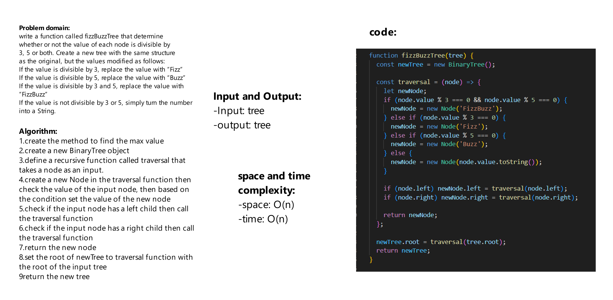

# Challenge Title
write a function called fizzBuzzTree that determine whether or not the value of each node is divisible by 3, 5 or both. Create a new tree with the same structure as the original, but the values modified as follows:
If the value is divisible by 3, replace the value with “Fizz”
If the value is divisible by 5, replace the value with “Buzz”
If the value is divisible by 3 and 5, replace the value with “FizzBuzz”
If the value is not divisible by 3 or 5, simply turn the number into a String.

## Whiteboard Process



## Approach & Efficiency

space: O(n)

time: O(n)


## Solution
```js
const two = new Node(2);
const seven = new Node(7);
const five = new Node(5);
const two2 = new Node(2);
const six = new Node(6);
const nine = new Node(9);
const five2 = new Node(5);
const eleven = new Node(11);
const four = new Node(4);

two.left = seven;
two.right = five;

seven.left = two2;
seven.right = six;

five.right = nine;

six.left = five2;
six.right = eleven;

nine.left = four;


const tree = new BinaryTree(two);

console.log(fizzBuzzTree(tree));
```
