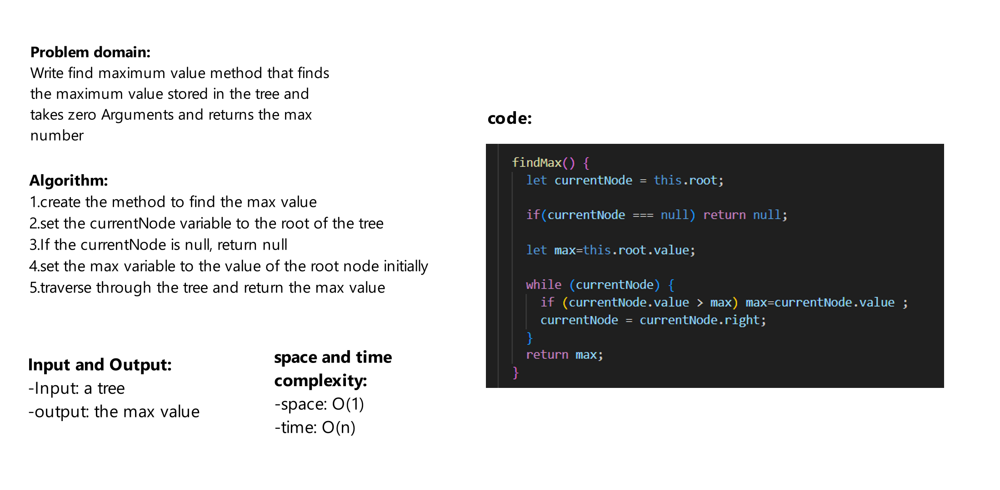

# Challenge Title
Write find maximum value method that finds the maximum value stored in the tree and takes zero Arguments and returns the max number

## Whiteboard Process



## Approach & Efficiency

space: O(1)

time: O(n)


## Solution
```js
const tree = new BinarySearchTree();

tree.add(1);
tree.add(2);
tree.add(16);
tree.add(0);
tree.add(23);
tree.add(22);
tree.add(7);

console.log(tree.findMax());//23


```
