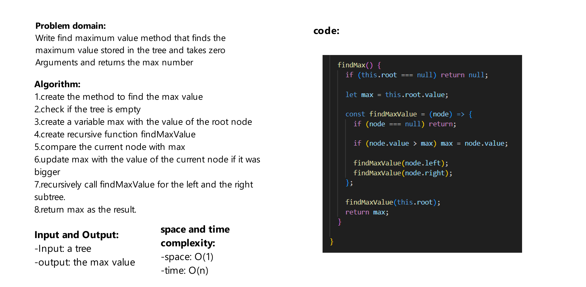

# Challenge Title
Write find maximum value method that finds the maximum value stored in the tree and takes zero Arguments and returns the max number

## Whiteboard Process



## Approach & Efficiency

space: O(1)

time: O(n)


## Solution
```js
const one = new Node(1);
const two = new Node(2);
const three = new Node(3);
const four = new Node(4);
const five = new Node(5);
const six = new Node(6);

one.left = two;
one.right = three;

two.left = four;
two.right = five;

three.left = six;

const tree = new BinaryTree(one);

console.log(tree.findMax());


```
