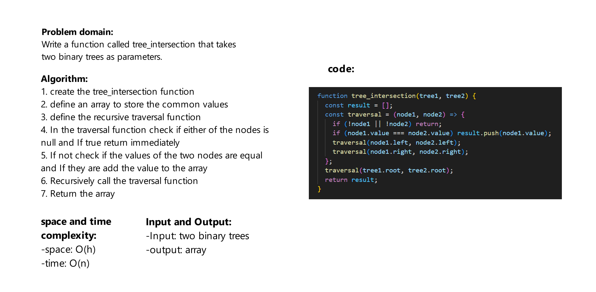

# Challenge Title
Write a function called tree_intersection that takes two binary trees as parameters, then return a set of values found in both trees.

## Whiteboard Process



## Approach & Efficiency
space: O(h)

time: O(n)


## Solution
```js

const one = new Node(1);
const two = new Node(2);
const three = new Node(3);
const four = new Node(4);
const five = new Node(5);
const six = new Node(6);

one.left = two;
one.right = three;

two.left = four;
two.right = five;

three.left = six;

const tree1 = new BinaryTree(one);

const thirtyThree = new Node(33);
const seventyOne = new Node(71);
const threeT2 = new Node(3);
const ten = new Node(10);
const fiveT2 = new Node(5);
const nineteen = new Node(19);

thirtyThree.left = seventyOne;
thirtyThree.right = threeT2;

seventyOne.left = ten;
seventyOne.right = fiveT2;

threeT2.left = nineteen;

const tree2 = new BinaryTree(thirtyThree);

tree_intersection(tree1, tree2)

```
