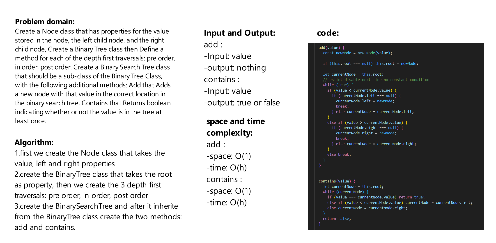

# Challenge Title
Create a Node class that has properties for the value stored in the node, the left child node, and the right child node,
Create a Binary Tree class
Define a method for each of the depth first traversals: pre order,
in order, post order
Create a Binary Search Tree class that should be a sub-class  of the Binary Tree Class, with the following additional methods:
Add that Adds a new node with that value in the correct location in the binary search tree.
Contains that Returns boolean indicating whether or not the value is in the tree at least once.

## Whiteboard Process



## Approach & Efficiency
- add :

    space: O(1)

    time: O(h)

- contains :

    space: O(1)

    time: O(h)

## Solution
```js
const tree2 = new BinarySearchTree();

tree2.add(1);
tree2.add(2);
tree2.add(3);
tree2.add(4);
tree2.add(5);

console.log(tree2);
console.log(tree2.contains(2));

```
